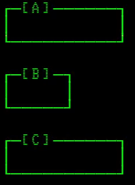

# ascii-ui

There are several projects [[1]](https://www.npmjs.com/package/term-canvas) allowing you to use the JavaScript canvas in the terminal, while other projects [[1]](https://github.com/chjj/blessed)[[2]](https://github.com/ghaiklor/terminal-canvas)[[3]](https://www.npmjs.com/package/terminal-kit) give you some IU tools to create text-based interfaces in the terminal, but... have you ever needed (or just wanted) to use a text-based UI in a HTML page?

No? _Really_, not even once?

Well, thanks to my lack of empathy, this project gives you access to a [ncurses](https://www.gnu.org/software/ncurses/ncurses.html)_-like_ low-level interface working over a [HTMLCanvasElement](https://developer.mozilla.org/en-US/docs/Web/API/HTMLCanvasElement) buffer to render characters like the old style terminals (_apart from the great perk of using your time to fight with this library instead of being laying in the corner of a dark street giving yourself to the drugs and alcohol_).

You can check some prepared examples [already deployed here](https://ascii-ui.danikaze.com), and [check their code](./examples) to see how to use the library.

This examples can be built with the `npm run examples` or `yarn examples` command, or just be deployed in the development server via `npm run start` or `yarn start`.

Also, you can check the [api documentation here](./docs), if you want to know more details about the library usage.

## Changelog

### 0.2.0

Core:
- Added support for spriteFonts (`Terminal.setImage`)
- Added `minWidth`, `minHeight`, `maxWidth` and `maxHeight` options to the `Terminal`
- Added `Widget.destruct`

Widgets:
- Added border feature in `widgets/Grid`
- Improved `widgets/Select` with new methods and styling options

Others:
- Added `EventManager.removeListener` (and rename `listen` to `addListener`)
- Cleaner code with new tslint rules

### 0.1.0

First _version_ of the `Terminal` with a few widgets (`Box`, `Grid`, `Input`, `ProgressBar`, `Select`, `Text`), a `FocusManager` and an `EventManager`.

Usable but still in development, so the interface could change and _bugs can happen_.

Feel free to test it and create an [issue](https://github.com/danikaze/ascii-ui/issues) with any bug you found or any idea/request you might have.

